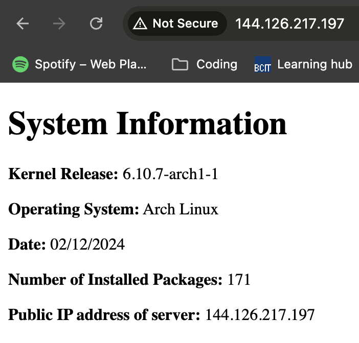

# LinuxAssign3Pt2

## Setup in DigitalOcean

Step 1: create two droplets sharing the same tag "web":


Step 2: create a public load balancer for all droplets with "web" tag:


## Setup droplets using Pt1 steps

The following steps are the same with Assignment 3 Part 1, in order to build a automated system setup for generating and serving a system info html using Nginx:

> The following steps are performed on droplet `arch-assign3-01`. Assume pacman is up-to-date and servers are installed with `vim` text editor.

Step 1: create a system user `webgen` with specified home directory and a non-login shell, run:

```
sudo useradd -r -d /var/lib/webgen -s /usr/sbin/nologin webgen
```

Step 2: create the `webgen` directory in /var/lib to store the documents we needed later:

```
sudo mkdir /var/lib/webgen
```

> Now we will create the service and timer unit files following step 3 to step 5

Step 3: create generate_index.service file in system directory, run:

```
sudo vim /etc/systemd/system/generate_index.service
```

Script content is attached in `Pt1_Setup/generate_index.service`

Step 4: create generate_index.timer file in system directory, run:

```
sudo vim /etc/systemd/system/generate_index.timer
```

Script content is attached in `Pt1_Setup/generate_index.timer`

Step 5: After setting up both files, reload the system daemon. then enable and run both unit files.

> Now we will configure Nginx from step 6 to step 9

Step 6: Configure nginx.conf with new user and separted server block file as shown in the image:


Step 7: to store server block file separately, to organize and manage server block configurations more efficiently, create the following directories:

```
sudo mkdir /etc/nginx/sites-available
sudo mkdir /etc/nginx/sites-enabled
```

Step 8: add the server block file by running:

```
sudo vim /etc/nginx/sites-available/webgen
```

Then paste the following server block content:


Step 9: Enable nginx:

First create symlink for the server block:

```
sudo ln -s /etc/nginx/sites-available/webgen /etc/nginx/sites-enabled/webgen
```

> Ensure permissions for `webgen` user:

```
sudo chown -R webgen:webgen /var/lib/webgen
sudo chmod -R 755 /var/lib/webgen
```

Second we start nginx and generate_index service:

```
sudo systemctl start nginx
```

Then we can access the nginx index.html by its ip addr:


## Pt2 setup

Step 1: create a local dir named `webgen` with the files and structure the same as:


Step 2: transfer local directory to `/var/lib/webgen`, run under `sftp` mode:

```
put -r <local path to webgen directory>
```

## Pt2 validation

Step 1: Permission check:
To start generate_index service, first we run the following command to ensure we have **execute** permission:

```
sudo ls -l /var/lib/webgen/bin/generate_index
```

> If not, run the following command as displayed in the image:
> 

Step 2: Start service to generate html, run the following:

```
sudo systemctl start generate_index.service
```

> To check the service running status, run the following command and the output will be:


Step 3: Verify by accessing <droplet1_ipaddr>/documents in browser, the output will be:


## Connect with load balancer

> Repeat the previous steps for droplet 2 `arch-assign3-02` to setup both droplets with same configurations.

Now we can use the ip addr of the load balancer to access both droplets, refresh several times to view content from both servers, the output will be:

- LB direct to server 1
  

- LB direct to server 2
  
